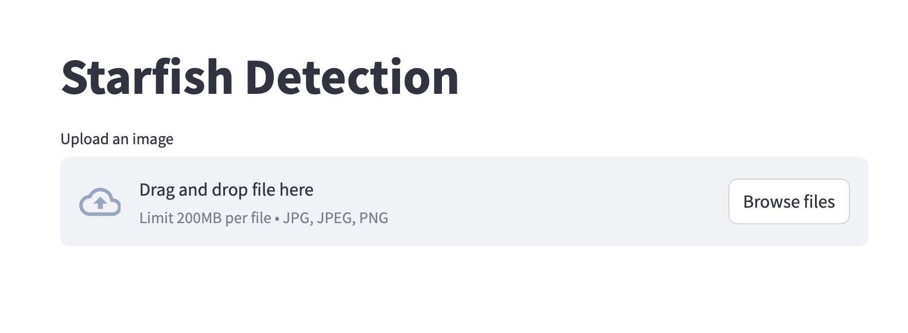
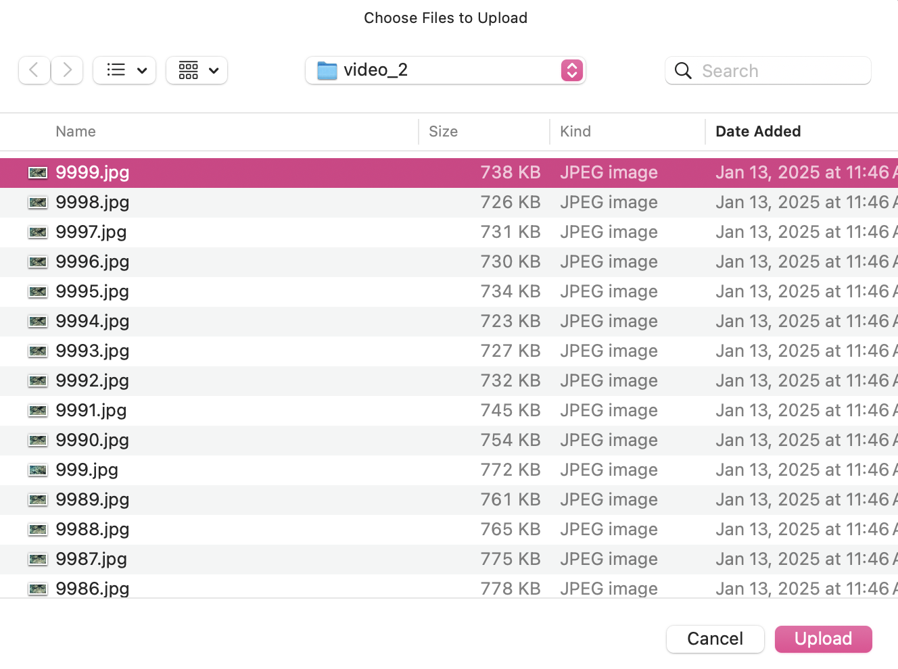
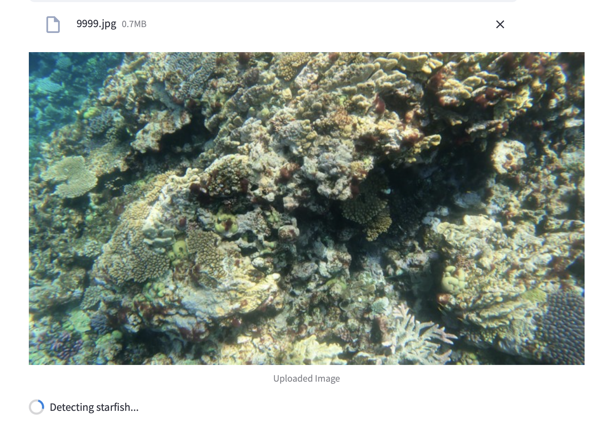
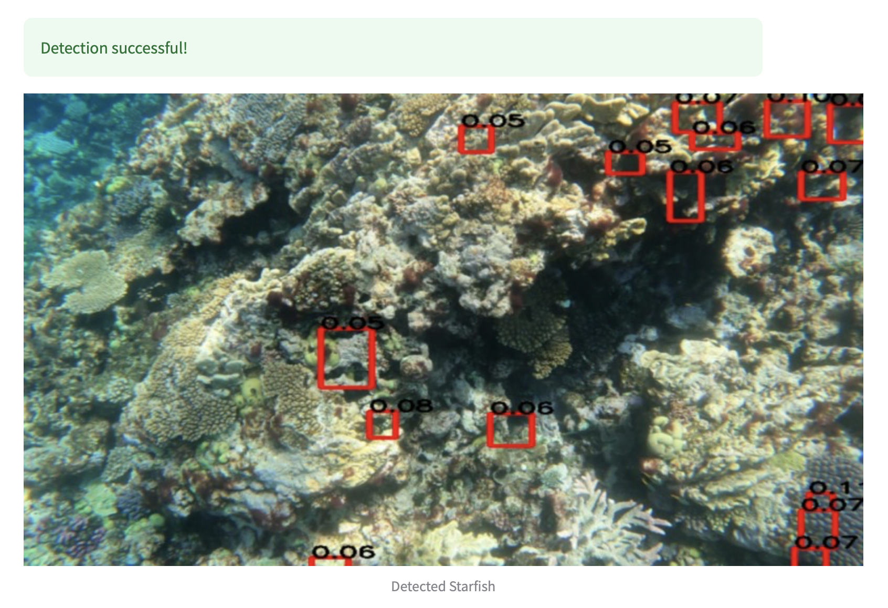
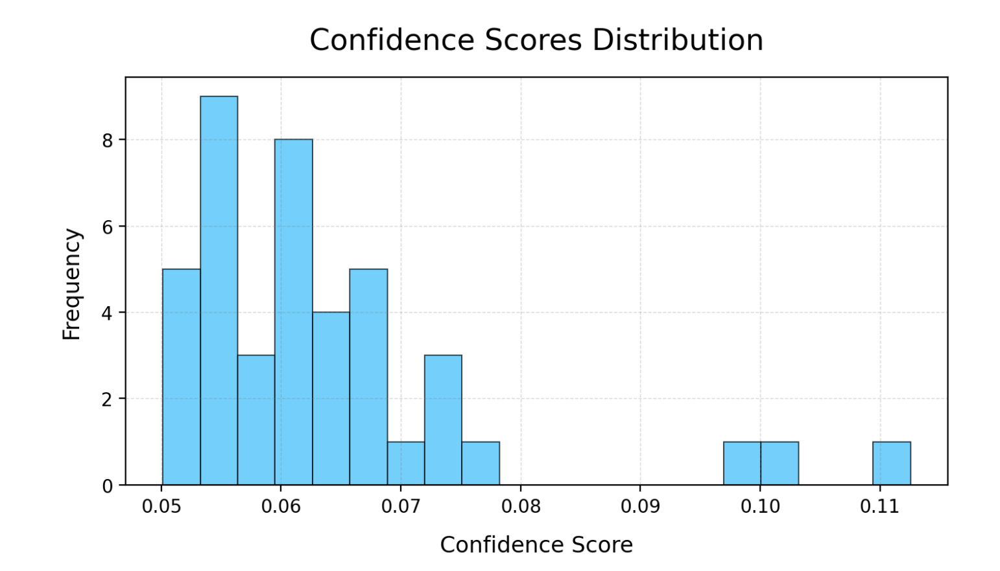
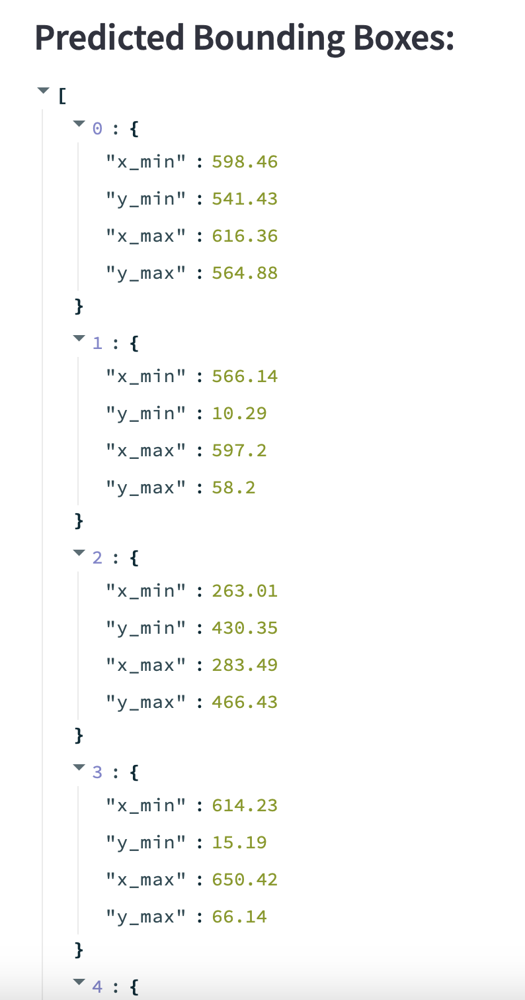

# Application

Users can interact with our application using the backend or the frontend.

## Backend
To obtain predictions on an image by communicating with the API directly, you can use a curl command. To use the PyTorch model for inference, run
```bash
curl -X 'POST' 'https://backend-638730968773.us-central1.run.app/inference/' -H 'accept: application/json' -H 'Content-Type: multipart/form-data' -F 'data=@PATH_TO_IMAGE;type=image/jpeg'
```
To use the ONNX model for inference, run
```bash
curl -X 'POST' 'https://backend-638730968773.us-central1.run.app/onnx-inference/' -H 'accept: application/json' -H 'Content-Type: multipart/form-data' -F 'data=@PATH_TO_IMAGE;type=image/jpeg'
```

## Frontend
For a more user-friendly experience, you can access our frontend webpage at [https://frontend-638730968773.us-central1.run.app](https://frontend-638730968773.us-central1.run.app).

Follow these steps to get predictions on an image.

1. Click `Browse files`.


2. Select your desired image.


3. You should then see the image you selected appear.


4. Once the inference has finished, you will see boxes on your image around predicted starfish along with confidence scores.


5. Below you will also see a histogram over the confidence scores for your image.


6. Finally, you get a matrix of the bounding box coordinates in pixel coordinates.

