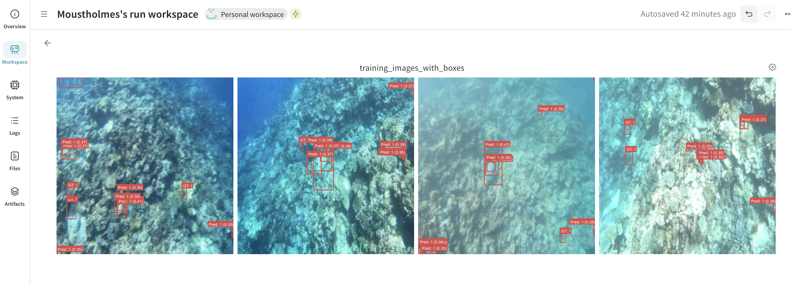
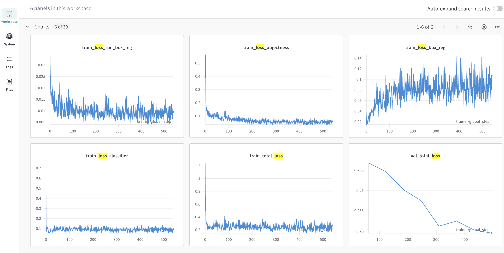
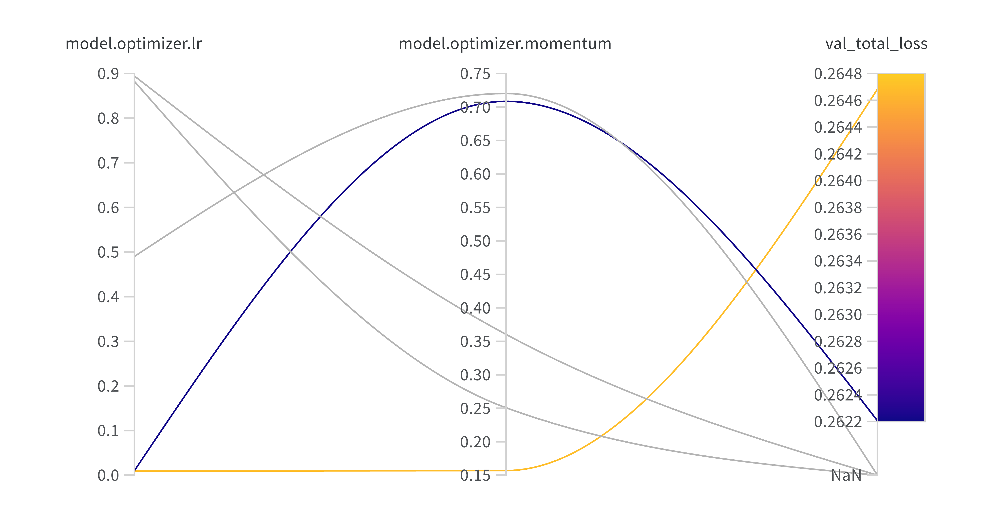
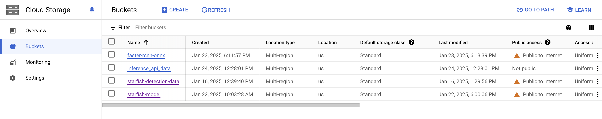
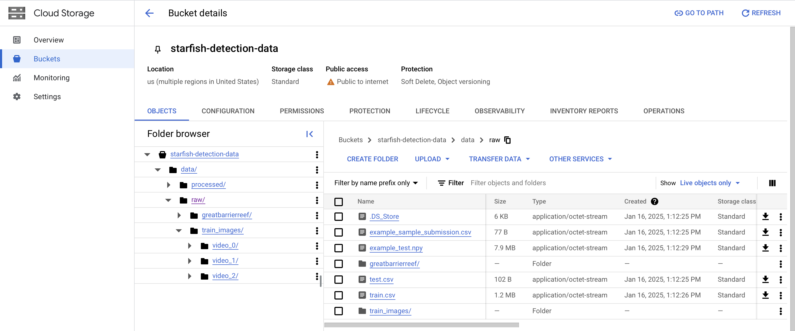
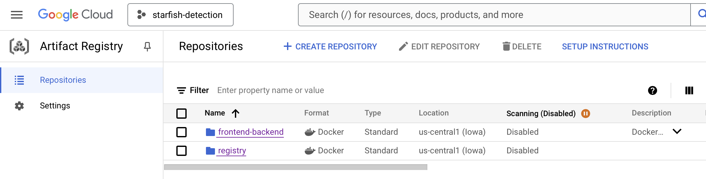
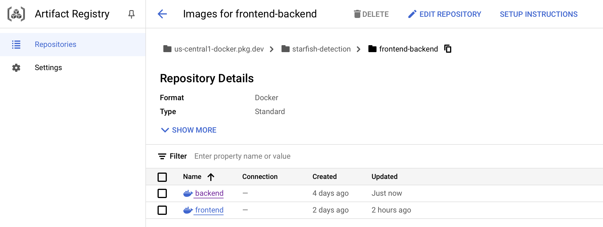

# Exam template for 02476 Machine Learning Operations

This is the report template for the exam. Please only remove the text formatted as with three dashes in front and behind
like:

```--- question 1 fill here ---```

Where you instead should add your answers. Any other changes may have unwanted consequences when your report is
auto-generated at the end of the course. For questions where you are asked to include images, start by adding the image
to the `figures` subfolder (please only use `.png`, `.jpg` or `.jpeg`) and then add the following code in your answer:

```markdown

```

In addition to this markdown file, we also provide the `report.py` script that provides two utility functions:

Running:

```bash
python report.py html
```

Will generate a `.html` page of your report. After the deadline for answering this template, we will auto-scrape
everything in this `reports` folder and then use this utility to generate a `.html` page that will be your serve
as your final hand-in.

Running

```bash
python report.py check
```

Will check your answers in this template against the constraints listed for each question e.g. is your answer too
short, too long, or have you included an image when asked. For both functions to work you mustn't rename anything.
The script has two dependencies that can be installed with

```bash
pip install typer markdown
```

## Overall project checklist

The checklist is *exhaustive* which means that it includes everything that you could do on the project included in the
curriculum in this course. Therefore, we do not expect at all that you have checked all boxes at the end of the project.
The parenthesis at the end indicates what module the bullet point is related to. Please be honest in your answers, we
will check the repositories and the code to verify your answers.

### Week 1

* [X] Create a git repository (M5)
* [X] Make sure that all team members have write access to the GitHub repository (M5)
* [X] Create a dedicated environment for you project to keep track of your packages (M2)
* [X] Create the initial file structure using cookiecutter with an appropriate template (M6)
* [X] Fill out the `data.py` file such that it downloads whatever data you need and preprocesses it (if necessary) (M6)
* [X] Add a model to `model.py` and a training procedure to `train.py` and get that running (M6)
* [X] Remember to fill out the `requirements.txt` and `requirements_dev.txt` file with whatever dependencies that you
    are using (M2+M6)
* [X] Remember to comply with good coding practices (`pep8`) while doing the project (M7)
* [X] Do a bit of code typing and remember to document essential parts of your code (M7)
* [X] Setup version control for your data or part of your data (M8)
* [X] Add command line interfaces and project commands to your code where it makes sense (M9)
* [X] Construct one or multiple docker files for your code (M10)
* [X] Build the docker files locally and make sure they work as intended (M10)
* [X] Write one or multiple configurations files for your experiments (M11)
* [X] Used Hydra to load the configurations and manage your hyperparameters (M11)
* [X] Use profiling to optimize your code (M12)
* [X] Use logging to log important events in your code (M14)
* [X] Use Weights & Biases to log training progress and other important metrics/artifacts in your code (M14)
* [X] Consider running a hyperparameter optimization sweep (M14)
* [X] Use PyTorch-lightning (if applicable) to reduce the amount of boilerplate in your code (M15)

### Week 2

* [X] Write unit tests related to the data part of your code (M16)
* [X] Write unit tests related to model construction and or model training (M16)
* [X] Calculate the code coverage (M16)
* [X] Get some continuous integration running on the GitHub repository (M17)
* [X] Add caching and multi-os/python/pytorch testing to your continuous integration (M17)
* [X] Add a linting step to your continuous integration (M17)
* [X] Add pre-commit hooks to your version control setup (M18)
* [X] Add a continues workflow that triggers when data changes (M19)
* [ ] Add a continues workflow that triggers when changes to the model registry is made (M19)
* [X] Create a data storage in GCP Bucket for your data and link this with your data version control setup (M21)
* [X] Create a trigger workflow for automatically building your docker images (M21)
* [X] Get your model training in GCP using either the Engine or Vertex AI (M21)
* [X] Create a FastAPI application that can do inference using your model (M22)
* [X] Deploy your model in GCP using either Functions or Run as the backend (M23)
* [X] Write API tests for your application and setup continues integration for these (M24)
* [X] Load test your application (M24)
* [X] Create a more specialized ML-deployment API using either ONNX or BentoML, or both (M25)
* [X] Create a frontend for your API (M26)

### Week 3

* [ ] Check how robust your model is towards data drifting (M27)
* [ ] Deploy to the cloud a drift detection API (M27)
* [ ] Instrument your API with a couple of system metrics (M28)
* [ ] Setup cloud monitoring of your instrumented application (M28)
* [ ] Create one or more alert systems in GCP to alert you if your app is not behaving correctly (M28)
* [X] If applicable, optimize the performance of your data loading using distributed data loading (M29)
* [X] If applicable, optimize the performance of your training pipeline by using distributed training (M30)
* [X] Play around with quantization, compilation and pruning for you trained models to increase inference speed (M31)

### Extra

* [ ] Write some documentation for your application (M32)
* [ ] Publish the documentation to GitHub Pages (M32)
* [X] Revisit your initial project description. Did the project turn out as you wanted?

The project largely turned out as we wanted. The main change we made was to use the FasterRCNN model instead of the YOLO11 model. We made this switch primarily because it did not seem to be straightforward to modify the architecture of YOLO11 to support two classes, whereas this was an input parameter to FasterRCNN.
* [ ] Create an architectural diagram over your MLOps pipeline
* [X] Make sure all group members have an understanding about all parts of the project
* [X] Uploaded all your code to GitHub

## Group information

### Question 1
> **Enter the group number you signed up on <learn.inside.dtu.dk>**
>
> Answer:

36

### Question 2
> **Enter the study number for each member in the group**
>
> Example:
>
> *sXXXXXX, sXXXXXX, sXXXXXX*
>
> Answer:

*s195398, s194242, s243077, s247157, s250797*

### Question 3
> **A requirement to the project is that you include a third-party package not covered in the course. What framework**
> **did you choose to work with and did it help you complete the project?**
>
> Recommended answer length: 100-200 words.
>
> Example:
> *We used the third-party framework ... in our project. We used functionality ... and functionality ... from the*
> *package to do ... and ... in our project*.
>
> Answer:

We used the third-party image augmentation library, [Albumentations](https://github.com/albumentations-team/albumentations). This framework supports a wide range of computer vision tasks, including object detection, which makes it well suited for our project. Furthermore it is the fastest available augmentation library which was important given the size of our dataset. We used Albumentations to enhance our training dataset by applying various transformations such as random rotations, flips, scaling, and color adjustments to the images. These augmentations were applied to prevent overfitting and improve the model's generalization capabilities.
Overall Albumentations was pretty easy to implement with the only exeptions that using np.random.seed(0) random.seed(0) pl.seed_everything(0) didn't fix the random augmentations which we only discovered when we started logging training images. Turns out you have to pass a random seed to the transform class.

## Coding environment

> In the following section we are interested in learning more about you local development environment. This includes
> how you managed dependencies, the structure of your code and how you managed code quality.

### Question 4

> **Explain how you managed dependencies in your project? Explain the process a new team member would have to go**
> **through to get an exact copy of your environment.**
>
> Recommended answer length: 100-200 words
>
> Example:
> *We used ... for managing our dependencies. The list of dependencies was auto-generated using ... . To get a*
> *complete copy of our development environment, one would have to run the following commands*
>
> Answer:

We managed dependencies in our project by using requirements files. Whenever we needed a new package we added it to the file and used `pip show PACKAGE` to get the package version, which we then added to the requirements file. When developing locally we created a Conda environment wherein we installed all the packages in the requirements files, and when developing on the Cloud we installed the packages directly into a Docker container. The `Documentation` section of the main README contains instructions on reproducing our environment exactly under the `Environment` subsection. The process involves creating a new Conda environment with a specific Python version and then installing the packages in the requirements files.

### Question 5

> **We expect that you initialized your project using the cookiecutter template. Explain the overall structure of your**
> **code. What did you fill out? Did you deviate from the template in some way?**
>
> Recommended answer length: 100-200 words
>
> Example:
> *From the cookiecutter template we have filled out the ... , ... and ... folder. We have removed the ... folder*
> *because we did not use any ... in our project. We have added an ... folder that contains ... for running our*
> *experiments.*
>
> Answer:

We use hydra for config files and make use the instantiate function for the main 4 objects: the pytorch lightning module, data module and trainer and the wandb logger
code:
- Code for the pytorch lightning module is in src/starfish/model.py
- Code for the pytorch lightning data module is in src/starfish/data.py
configs:
- Config for the pytorch lightning module is in config/model/default_model.yaml
- Config for the pytorch lightning data module is in config/data/default_data_module.yaml
- Config for the pytorch lightning trainer is in config/trainer/default_trainer.yaml
- Config for the wandb logger is in config/logger/wandb_logger.yaml

we make use of the experiments configs to make overides to the default config fx. with the train_local.yaml  for changing the data directory from a bucket to local data and limiting the train val and test batches.


### Question 6

> **Did you implement any rules for code quality and format? What about typing and documentation? Additionally,**
> **explain with your own words why these concepts matters in larger projects.**
>
> Recommended answer length: 100-200 words.
>
> Example:
> *We used ... for linting and ... for formatting. We also used ... for typing and ... for documentation. These*
> *concepts are important in larger projects because ... . For example, typing ...*
>
> Answer:

To ensure good code quality we used Ruff. Ruff is a pip package that helps us finding and correcting lines of code that are not complying with the pep8 coding guidelines. To enforce the rules we added a pre-commit hook with "pip install pre-commit" that will block commits from being pushed if the modified files does not comply with pep8. Furthermore, we have added a workflow that will trigger every time we push changes to a pull-request or to the main branch that will run ruff commands to format the code in a way that complies with pep8. This saves means we don't have to run the ruff commands manually.

## Version control

> In the following section we are interested in how version control was used in your project during development to
> corporate and increase the quality of your code.

### Question 7

> **How many tests did you implement and what are they testing in your code?**
>
> Recommended answer length: 50-100 words.
>
> Example:
> *In total we have implemented X tests. Primarily we are testing ... and ... as these the most critical parts of our*
> *application but also ... .*
>
> Answer:

We have implemented tests for the data in tests/unittests/test_data.py which cover the StarfishDataset and the StarfishDataModule
and for the FasterRCNNLightning model and the FasterRCNNLightning module in tests/unittests/test_model.py

We have also implemented integration test for the API and the utility functions.

we currently don't test the train.py script as its mostly just instantiating the modules and running them.


### Question 8

> **What is the total code coverage (in percentage) of your code? If your code had a code coverage of 100% (or close**
> **to), would you still trust it to be error free? Explain you reasoning.**
>
> Recommended answer length: 100-200 words.
>
> Example:
> *The total code coverage of code is X%, which includes all our source code. We are far from 100% coverage of our **
> *code and even if we were then...*
>
> Answer:
The total code coverage is 24%. We cover the most essential parts of the code like api, model and data. The files that doesn't have test coverage are files that are hard to test like callbacks or files that are used for tests like image_drift.py.
Even if we had a 100% code coverage we are not guarenteed to be error free. You can have a high code coverage but with low test quality if the tests do not account for most of the use cases. But even if the quality of the tests were high, you can never be guarenteed an error free project.

``` bash
Name                                   Stmts   Miss  Cover   Missing
--------------------------------------------------------------------
src/starfish/__init__.py                   0      0   100%
src/starfish/callbacks.py                 47     47     0%   1-128
src/starfish/data.py                     113     30    73%   41-43, 81-82, 87-88, 95, 121-126, 141-162, 173-179, 233
src/starfish/evaluate.py                  32     32     0%   1-48
src/starfish/image_drift.py              109    109     0%   1-284
src/starfish/model.py                     60     34    43%   53-59, 67-81, 95-106, 117-118, 125-141
src/starfish/onnx_model.py                28     28     0%   1-51
src/starfish/profile_forward_pass.py      15     15     0%   1-21
src/starfish/train.py                     43     43     0%   1-69
src/starfish/visualize.py                 12     12     0%   1-18
--------------------------------------------------------------------
TOTAL                                    459    350    24%
```
### Question 9

> **Did you workflow include using branches and pull requests? If yes, explain how. If not, explain how branches and**
> **pull request can help improve version control.**
>
> Recommended answer length: 100-200 words.
>
> Example:
> *We made use of both branches and PRs in our project. In our group, each member had an branch that they worked on in*
> *addition to the main branch. To merge code we ...*
>
> Answer:

Yes, we made use of both branches and PRs in our project. Each team member worked on separate feature branches dedicated to specific tasks. This minimized code conflicts and ensured that the main branch remain stable. Once a task was completed, the developer would create a pull request to merge their feature branch into the main branch. Before merging, the PR underwent a code review process where other team members would examine the changes for quality, consistency, and potential issues. Additionally, using PRs allowed us to run automated tests and integrations checks, ensuring that new code did not introduce bugs or break existing functionalities. This was also discussed in question 6.

### Question 10

> **Did you use DVC for managing data in your project? If yes, then how did it improve your project to have version**
> **control of your data. If no, explain a case where it would be beneficial to have version control of your data.**
>
> Recommended answer length: 100-200 words.
>
> Example:
> *We did make use of DVC in the following way: ... . In the end it helped us in ... for controlling ... part of our*
> *pipeline*
>
> Answer:

Yes, we used DVC for managing data in our project. Since our project used an existing public static dataset we did not strictly need version control for our data. We used DVC to push the dataset to a Google Cloud Bucket with object versioning. However, the dvc pull command did not work for us, so we used gsutil -m cp -r gs://starfish-detection-data . instead. It would be beneficial to have version control of the data in a case where new data is collected over time and we want to be able to retrain the model as the new data comes in. This is especially important if there is a data distribution shift, in which case training on the updated data is crucial to continued model performance. Nonetheless, we may also want to be able to analyze the distribution of the data at different points, so having access to previous versions would be important.

### Question 11

> **Discuss you continuous integration setup. What kind of continuous integration are you running (unittesting,**
> **linting, etc.)? Do you test multiple operating systems, Python  version etc. Do you make use of caching? Feel free**
> **to insert a link to one of your GitHub actions workflow.**
>
> Recommended answer length: 200-300 words.
>
> Example:
> *We have organized our continuous integration into 3 separate files: one for doing ..., one for running ... testing*
> *and one for running ... . In particular for our ..., we used ... .An example of a triggered workflow can be seen*
> *here: <weblink>*
>
> Answer:

Our continuous integration setup included unit testing, linting, and data monitoring. We tested with multiple operating systems, Python versions, and PyTorch versions. We also made use of caching. [https://github.com/mmmmaja/starfishDetection/actions/runs/12907978581](Check pre-commit example action workflow) shows one of our GitHub actions workflows.

## Running code and tracking experiments

> In the following section we are interested in learning more about the experimental setup for running your code and
> especially the reproducibility of your experiments.

### Question 12

> **How did you configure experiments? Did you make use of config files? Explain with coding examples of how you would**
> **run a experiment.**
>
> Recommended answer length: 50-100 words.
>
> Example:
> *We used a simple argparser, that worked in the following way: Python  my_script.py --lr 1e-3 --batch_size 25*
>
> Answer:

As mentioned in Question 5 we use Hydra for our config files so all the default parameters are set in the main_config which defines which config to use as default. For changing the configs we can use Hydra from the terminal like

```bash
train data.batch_size=128
```
or write an experiment config with several overrides like with our train_local.yaml which we can run with

```bash
train +experiment=train_local
```

### Question 13

> **Reproducibility of experiments are important. Related to the last question, how did you secure that no information**
> **is lost when running experiments and that your experiments are reproducible?**
>
> Recommended answer length: 100-200 words.
>
> Example:
> *We made use of config files. Whenever an experiment is run the following happens: ... . To reproduce an experiment*
> *one would have to do ...*
>
> Answer:

We did several things to ensure reproducibility. First, all parameters and hyperparameters are saved on Wandb whenever an experiment is run. In addition, we have these lines in `trainer.py` to ensure that random number generation does not impact reproducibility.

```
torch.manual_seed(0)
np.random.seed(0)
random.seed(0)
pl.seed_everything(0)

os.environ["CUBLAS_WORKSPACE_CONFIG"] = ":4096:8"  # sets CuBLAS workspace configuration for deterministic behavior
torch.backends.cudnn.deterministic = True  # ensures that the CUDA backend produces deterministic results
torch.backends.cudnn.benchmark = False  # disables CuDNN benchmarking, which can introduce non-deterministic behavior
```
We did however discover that Albumentation introduced some randomness even with all the random seeds set.  We managed to fix it by using a seen in the transforms.

### Question 14

> **Upload 1 to 3 screenshots that show the experiments that you have done in W&B (or another experiment tracking**
> **service of your choice). This may include loss graphs, logged images, hyperparameter sweeps etc. You can take**
> **inspiration from [this figure](figures/wandb.png). Explain what metrics you are tracking and why they are**
> **important.**
>
> Recommended answer length: 200-300 words + 1 to 3 screenshots.
>
> Example:
> *As seen in the first image when have tracked ... and ... which both inform us about ... in our experiments.*
> *As seen in the second image we are also tracking ... and ...*
>
> Answer:

We made use of W&B for experiment tracking. The faster R-CNN uses a sum of different losses which we all track and we implemented Mean-Average-Precision (mAP) and Intersection Over Union (IoU) using torchmetrics we end up tracking a total of 39 different metrics.
However not all the losses from the faster R-CNN seam to be applicaple like map_per_classes as we only have one class so it stays at -1 during all of training. We also implemented image logging with overlay for the ground truth of the bounding boxes for the starfish and the top n predictions with the highest confidence score.(The images are from the start of training so very little overlap with predictions and targets)
Logging images with the predictions and targets on allows us to visually see if the model is learning what we want where it can be harder to understand what a mAP of 0.04 compared to a map of 0.01 means.
Logging can however quickly become computationally expensive especially with the faster R-CNN model where we have to put the model in eval mode and then do another forward pass to get predictions instead of the loss. We have therefore implemented logging at fixed intervals during training.




### Question 15

> **Docker is an important tool for creating containerized applications. Explain how you used docker in your**
> **experiments/project? Include how you would run your docker images and include a link to one of your docker files.**
>
> Recommended answer length: 100-200 words.
>
> Example:
> *For our project we developed several images: one for training, inference and deployment. For example to run the*
> *training docker image: `docker run trainer:latest lr=1e-3 batch_size=64`. Link to docker file: <weblink>*
>
> Answer:

We used docker in our project to containerize the training, backend, and frontend portions of the project. We wrote one dockerfile for each of these parts and then set up automatic building and pushing using Cloud Build and a trigger that listened for pushes to the master branch of our repository. All of our images were stored in the Artifact Registry. We then accessed our training image with Vertex AI to set up training runs and used our backend and frontend images in Cloud Run for deployment of our API and application. Our training image can be run with the `invoke train-vertex` command. Our backend and frontend images can be run on the cloud with `gcloud run deploy backend --image=us-central1-docker.pkg.dev/starfish-detection/frontend-backend/backend:latest --region=us-central1 --platform=managed --allow-unauthenticated --port=8080` and `gcloud run deploy frontend --image=us-central1-docker.pkg.dev/starfish-detection/frontend-backend/frontend:latest --region=us-central1 --platform=managed --allow-unauthenticated --port=8080`, respectively. You can find all of our dockerfiles in the [dockerfiles](../dockerfiles) subfolder of our repository. For example, our training dockerfile is [here](../dockerfiles/train.dockerfile).

### Question 16

> **When running into bugs while trying to run your experiments, how did you perform debugging? Additionally, did you**
> **try to profile your code or do you think it is already perfect?**
>
> Recommended answer length: 100-200 words.
>
> Example:
> *Debugging method was dependent on group member. Some just used ... and others used ... . We did a single profiling*
> *run of our main code at some point that showed ...*
>
> Answer:

We used pdb at one point and another point used gihub history to find that the optimizer accidentaly was changed to ADAM.
Optimizer.step#SGD.step took the most CPU time in profiling of a total of 85.97% when profiling a two batches. The following slowest are all internal model function calls like aten::conv2d and we have to go very far down get to any code we have touched which is the dataloader. In general we found that the fasterrcnn_resnet50_fpn contrary to its name was really slow and when trying to run in with mps as gpu the runtime increased by orders of magnitude. I think that this is because some backend pytorch function aren't ported to mps yet which results in alot of moving data between cpu and gpu.

## Working in the cloud

> In the following section we would like to know more about your experience when developing in the cloud.

### Question 17

> **List all the GCP services that you made use of in your project and shortly explain what each service does?**
>
> Recommended answer length: 50-200 words.
>
> Example:
> *We used the following two services: Engine and Bucket. Engine is used for... and Bucket is used for...*
>
> Answer:


We used Cloud Build with a Trigger to automatically build our dockerfiles and then push the images to the Artifact Registry, which is for storing software artifacts such as Docker images.
Cloud Bucket is used to store objects such as data or models. We created a bucket for our data in GCP, one for the PyTorch model we deploy, one for the ONNX version of the model, and one to store data fed into the model during deployment for monitoring purposes.
Vertex AI is used for spinning up a virtual machine with compute resources, running a Docker container, and then shutting down the machine. We used this to train models.
Secret is used for storing objects that should not be made available to users or potentially other developers. We used Secret to store a Wandb API key.
We used Cloud Run for creating docker containers for our backend and frontend.

### Question 18

> **The backbone of GCP is the Compute engine. Explained how you made use of this service and what type of VMs**
> **you used?**
>
> Recommended answer length: 100-200 words.
>
> Example:
> *We used the compute engine to run our ... . We used instances with the following hardware: ... and we started the*
> *using a custom container: ...*
>
> Answer:

We did not make use of the Compute Engine in our project since we used Vertex AI instead. However, if we had used it we would have created an e2-medium instance or an NVIDIA T4 instance if we had GPU access and used a base image with Python and PyTorch. Then we would have SSH'd into the VM, cloned our repository, and trained a model. We would have had to close the instance at the end.

### Question 19

> **Insert 1-2 images of your GCP bucket, such that we can see what data you have stored in it.**
> **You can take inspiration from [this figure](figures/bucket.png).**
>
> Answer:




### Question 20

> **Upload 1-2 images of your GCP artifact registry, such that we can see the different docker images that you have**
> **stored. You can take inspiration from [this figure](figures/registry.png).**
>
> Answer:




### Question 21

> **Upload 1-2 images of your GCP cloud build history, so we can see the history of the images that have been build in**
> **your project. You can take inspiration from [this figure](figures/build.png).**
>
> Answer:

--- question 21 fill here ---

### Question 22

> **Did you manage to train your model in the cloud using either the Engine or Vertex AI? If yes, explain how you did**
> **it. If not, describe why.**
>
> Recommended answer length: 100-200 words.
>
> Example:
> *We managed to train our model in the cloud using the Engine. We did this by ... . The reason we choose the Engine*
> *was because ...*
>
> Answer:

Yes, we trained our model in the cloud using Vertex AI. We chose this over the Compute Engine so the VM would close automatically when the training was complete. First, this required a `train` image built from `train.dockerfile` to be in the Artifact Registry, which we did automatically with a Cloud Build Trigger. We pointed to this image in `vertex_ai_config.yaml`, which also specified our desired machine type. Then we filled out `vertex_ai_train.yaml`, which fetched the Wandb API key stored as a Secret on the cloud and included the command to run a custom AI job.
We ran `gcloud builds submit --config=vertex_ai_train.yaml` in the command line to start the job. We then went into the `Custom Jobs` tab in the `Training` section of Vertex AI to monitor the training process as well as the Wandb dashboard.

## Deployment

### Question 23

> **Did you manage to write an API for your model? If yes, explain how you did it and if you did anything special. If**
> **not, explain how you would do it.**
>
> Recommended answer length: 100-200 words.
>
> Example:
> *We did manage to write an API for our model. We used FastAPI to do this. We did this by ... . We also added ...*
> *to the API to make it more ...*
>
> Answer:

We did manage to write an inference API for our model using the FastAPI library. We hosted the trained model in a Google Cloud Storage Bucket, allowing our backend script to load it during initialization. The API includes the `\inference\` endpoint that accepts image uploads, processes them to identify starfish, and returns the results as a JSON response containing bounding boxes and confidence scores.

Additionally we automated the build of the Docker image required for deploying the backend. Every commit to the main branch triggers an automatic build of the Dockerfile and automatic pushing to the Artifact Registry. This simplified our workflow and minimized potential deployment errors.

### Question 24

> **Did you manage to deploy your API, either in locally or cloud? If not, describe why. If yes, describe how and**
> **preferably how you invoke your deployed service?**
>
> Recommended answer length: 100-200 words.
>
> Example:
> *For deployment we wrapped our model into application using ... . We first tried locally serving the model, which*
> *worked. Afterwards we deployed it in the cloud, using ... . To invoke the service an user would call*
> *`curl -X POST -F "file=@file.json"<weburl>`*
>
> Answer:

We did deploy our API in the cloud. Once the backend docker image was in the Artifact Registry, we used the `gcloud run deploy backend --image=us-central1-docker.pkg.dev/starfish-detection/frontend-backend/backend:latest --region=us-central1 --platform=managed --allow-unauthenticated --port=8080` command for deployment. This deployed service is available at [https://backend-638730968773.us-central1.run.app](https://backend-638730968773.us-central1.run.app) and can be invoked through a curl command:
```bash
curl -X 'POST' 'https://backend-638730968773.us-central1.run.app/inference/' -H 'accept: application/json' -H 'Content-Type: multipart/form-data' -F 'data=@PATH_TO_IMAGE;type=image/jpeg'
```
Furthermore, we built a frontend for this deployed API using the `streamlit` library. So a user can also invoke the API by uploading an image to the webpage `https://frontend-638730968773.us-central1.run.app`. Now we can visually inspect the model's perdictions and analyze the distribution of confidence scores.


### Question 25

> **Did you perform any unit testing and load testing of your API? If yes, explain how you did it and what results for**
> **the load testing did you get. If not, explain how you would do it.**
>
> Recommended answer length: 100-200 words.
>
> Example:
> *For unit testing we used ... and for load testing we used ... . The results of the load testing showed that ...*
> *before the service crashed.*
>
> Answer:

We performed both unit testing and load testing of our API. The unit tests were made with a script that requests our deployed endpoints. We had four different unit tests. The first two tests contact the back- and frontend respectively. Finally, we had two tests of the inference response for inference with the PyTorch and ONNX models respectively.

We did load testing with Locust. Here we stress tested the contacting the backend and doing inference with the regular model. We gave the backend endpoint a priority of one and the inference test a priority of three. After adding new endpoints, we did not add new tests to the locust file.

### Question 26

> **Did you manage to implement monitoring of your deployed model? If yes, explain how it works. If not, explain how**
> **monitoring would help the longevity of your application.**
>
> Recommended answer length: 100-200 words.
>
> Example:
> *We did not manage to implement monitoring. We would like to have monitoring implemented such that over time we could*
> *measure ... and ... that would inform us about this ... behaviour of our application.*
>
> Answer:

--- question 26 fill here ---

## Overall discussion of project

> In the following section we would like you to think about the general structure of your project.

### Question 27

> **How many credits did you end up using during the project and what service was most expensive? In general what do**
> **you think about working in the cloud?**
>
> Recommended answer length: 100-200 words.
>
> Example:
> *Group member 1 used ..., Group member 2 used ..., in total ... credits was spend during development. The service*
> *costing the most was ... due to ... . Working in the cloud was ...*
>
> Answer:

- s195398 had used a little more than $11.

### Question 28

> **Did you implement anything extra in your project that is not covered by other questions? Maybe you implemented**
> **a frontend for your API, use extra version control features, a drift detection service, a kubernetes cluster etc.**
> **If yes, explain what you did and why.**
>
> Recommended answer length: 0-200 words.
>
> Example:
> *We implemented a frontend for our API. We did this because we wanted to show the user ... . The frontend was*
> *implemented using ...*
>
> Answer:

Yes, we implemented a frontend for our API to provide users with an intuitive and interactive interface. It was build using the  `streamlit` library.
When a user uploads an image, the frontend sends it to the backend API, which processes the image to detect starfish and returns bounding boxes along with confidence scores. The bounding boxes are then overlayed on the original image, and displayed. Additionally, we included a histogram that shows the distribution of confidence scores.

### Question 29

> **Include a figure that describes the overall architecture of your system and what services that you make use of.**
> **You can take inspiration from [this figure](figures/overview.png). Additionally, in your own words, explain the**
> **overall steps in figure.**
>
> Recommended answer length: 200-400 words
>
> Example:
>
> *The starting point of the diagram is our local setup, where we integrated ... and ... and ... into our code.*
> *Whenever we commit code and push to GitHub, it auto triggers ... and ... . From there the diagram shows ...*
>
> Answer:

When developing this project, we started in our local setup, where we created a repository from a CookieCutter template. There, we used PyTorch Lightning as boilerplate to avoid repetitive coding. We used this to develop our model. To develop our code, we had to use a lot of different packages, which is why having a dedicated Python environment is useful. We all used Conda. To optimize and debug our model, we used PyTorch profiler and PDB.

To get the data locally for our model, we used Google Cloud data storage because we had problems with DVC pull. However, we could push data with DVC pull.

The model can be configured in different ways depending on local or cloud-based use cases which is why we used Hydra. We also used one place where we used Typer instead of Hydra due to a misunderstanding. Before pushing we used Pre-Commit-Hooks. We of course used Git for version control.

Once we have our model, we can convert it to ONNX to make it more lightweight and compatible with many other deep learning frameworks. We then store both our PyTorch model and ONNX model in a Google Cloud Bucket. This bucket also stores experimental loggings from Wandb. From this bucket, our FastAPI fetches the models depending on the requested endpoint from the frontend, which displays the result for the end-user.

When pushing to Git, our GitHub actions execute their workflows. These workflows include running all the unit, integration, and load tests, linting every file, and triggering the process of building and pushing our docker images to the artifact registry. From the artifact registry, the Cloud Run and Vertex AI can consume our containers. Tthe Cloud Run deploys both our back- and frontend. These can then save their image and predictions in another Google Cloud data storage for monitoring.


### Question 30

> **Discuss the overall struggles of the project. Where did you spend most time and what did you do to overcome these**
> **challenges?**
>
> Recommended answer length: 200-400 words.
>
> Example:
> *The biggest challenges in the project was using ... tool to do ... . The reason for this was ...*
>
> Answer:

Figuring out how to coordinate everyone's different branches and tasks was a bit challenging. It wasn't always clear how much progress had been made on different tasks, so communication about these things was needed. We also spent a lot of time on the API and getting the backend and frontend to run in the cloud. Giving the right access to the right service accounts was also a challenge. We asked the teaching staff for help and debugged together to overcome these challenges.
Faster R-CNN model also gave a lot of trouble as we were unable to run more the a few batches and trying to use gpus with mps made it orders of magnitude slower? The model also changes the forward methode when you switch between train and eval so you could only get the loss if the model was in train but you could only get the predictions if it was in eval which made logging hard because you would need two forward passes to get loss and predictions.

### Question 31

> **State the individual contributions of each team member. This is required information from DTU, because we need to**
> **make sure all members contributed actively to the project. Additionally, state if/how you have used generative AI**
> **tools in your project.**
>
> Recommended answer length: 50-300 words.
>
> Example:
> *Student sXXXXXX was in charge of developing of setting up the initial cookie cutter project and developing of the*
> *docker containers for training our applications.*
> *Student sXXXXXX was in charge of training our models in the cloud and deploying them afterwards.*
> *All members contributed to code by...*
> *We have used ChatGPT to help debug our code. Additionally, we used GitHub Copilot to help write some of our code.*
> Answer:

Moust Holmes did training script structure, hydra config files and wandb logging
